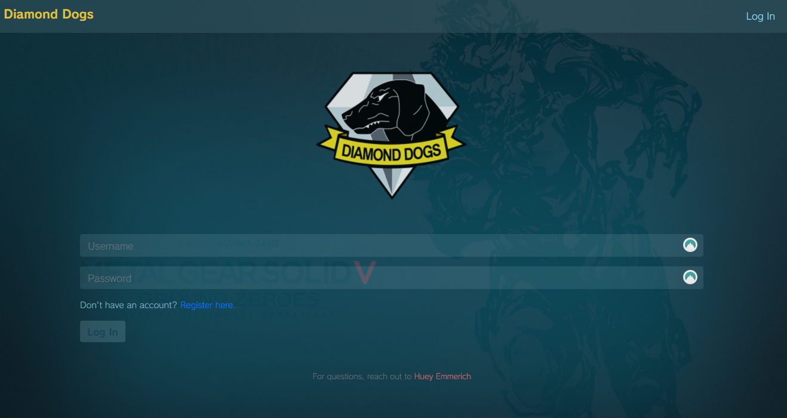
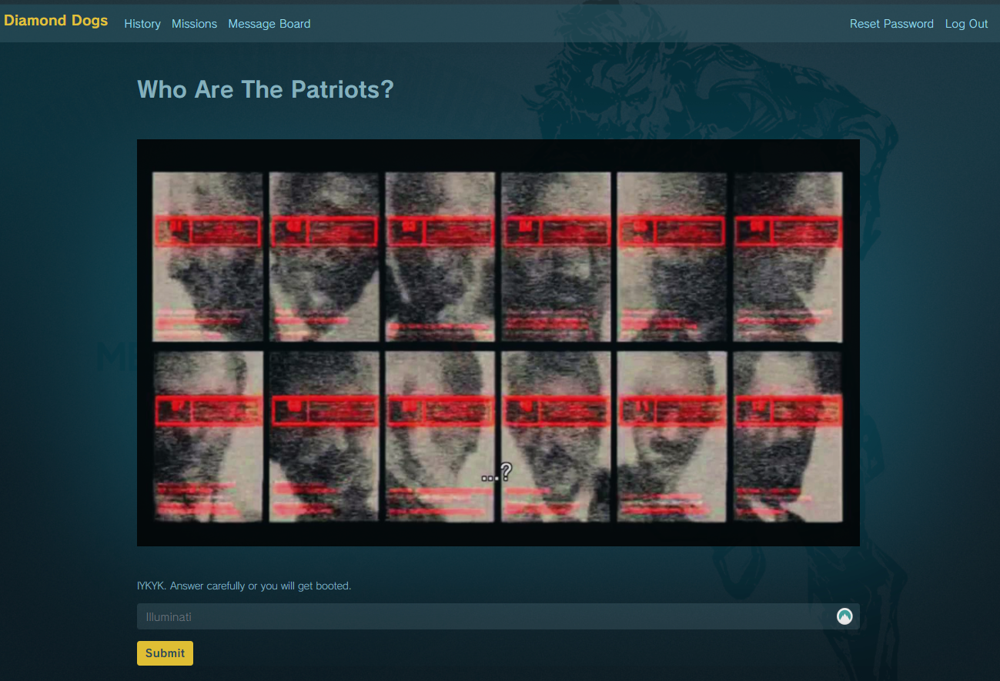
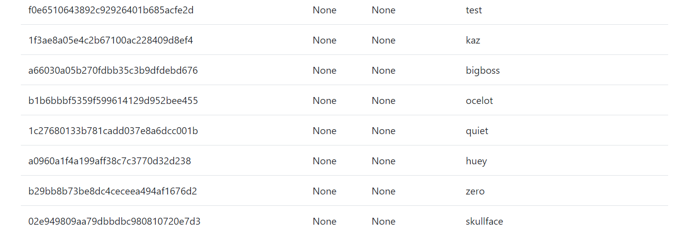
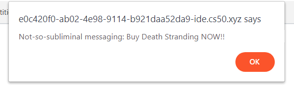

## **Mother Base:** A CS50 Vulnerable App

During the web development track, we learned how to prevent SQL injection via parameterization.
For my (working solo) final project, I wanted to create a vulnerable web app that would provide
some practice for folks interested in learning web application security. Attack opportunities I
want to provide:

- Information Disclosure: reveal sensitive info via robots.txt and humans.txt
    - Weak Encoding: include some ROT13, Base64, and cryptography challenges
    - Internal Threat: leaked hints in community message board
- Brute Force Login: use a common password found in the leaked rockyou.txt password dump to allow
for brute force login attempts.
- Directory Fuzzing: hidden panels discoverable via DIRB
    - Include the username of the community manager to give a hint
- SQLi Login: use string interpolation for login to introduce SQLi vulnerability. First user will
be test account.
- SQL Union Injection: allow the user to enumerate the users table to find additional hashes

To make this a bit more fun, I decided to theme this app around the Metal Gear Solid video game series.
Note: it is possible to acheive XSS and CSRF here, but we need to have an automated user agent in a VM
to make this a more effective learning opportunity.

## **Screenshots**

**Vulnerable Login**

**Path Fuzzing + OSINT**

**SQLi UNION Attack**

**Stored XSS**

## **Tools Used**

In line with the core web development track in CS50, this app utilizes the following:
- Python Flask backend
- SQLlite3 Database

## **Quickstart**

To give this app a whirl:
- clone this repo
- install any necessary python libraries via `pip3 install -r requirements.txt`
- from the base directory, run `flask run`
- enjoy!

## **Debugging**

Sometimes the custom fonts and/or some images won't load correctly the first time around - try
refreshing until it looks "right".
